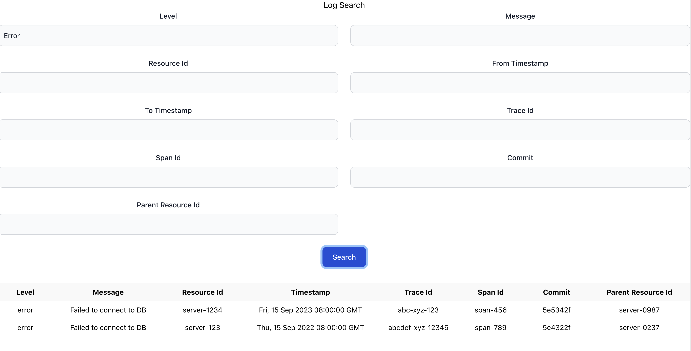

[](https://classroom.github.com/a/2sZOX9xt)
<!-- Improved compatibility of back to top link: See: https://github.com/othneildrew/Best-README-Template/pull/73 -->
<a name="readme-top"></a>
<!--
*** Thanks for checking out the Best-README-Template. If you have a suggestion
*** that would make this better, please fork the repo and create a pull request
*** or simply open an issue with the tag "enhancement".
*** Don't forget to give the project a star!
*** Thanks again! Now go create something AMAZING! :D
-->


<!-- PROJECT SHIELDS -->
<!--
*** I'm using markdown "reference style" links for readability.
*** Reference links are enclosed in brackets [ ] instead of parentheses ( ).
*** See the bottom of this document for the declaration of the reference variables
*** for contributors-url, forks-url, etc. This is an optional, concise syntax you may use.
*** https://www.markdownguide.org/basic-syntax/#reference-style-links
-->
[![Contributors][contributors-shield]][contributors-url]
[![Forks][forks-shield]][forks-url]
[![Stargazers][stars-shield]][stars-url]
[![Issues][issues-shield]][issues-url]
[![MIT License][license-shield]][license-url]
[![LinkedIn][linkedin-shield]][linkedin-url]


<!-- PROJECT LOGO -->
<br />
<div align="center">
  <a href="https://github.com/othneildrew/Best-README-Template">
    
  </a>

<h3 align="center">LogSearch</h3>

  <p align="center">
    A backend rust application for searching through logs efficiently.
    <br />
</p>
</div>


<!-- TABLE OF CONTENTS -->
<details>
  <summary>Table of Contents</summary>
  <ol>
    <li>
      <a href="#about-the-project">About The Project</a>
      <ul>
        <li><a href="#built-with">Built With</a></li>
      </ul>
    </li>
    <li>
      <a href="#getting-started">Getting Started</a>
      <ul>
        <li><a href="#prerequisites">Prerequisites</a></li>
        <li><a href="#installation">Installation</a></li>
      </ul>
    </li>
    <li><a href="#usage">Usage</a></li>
    <li><a href="#roadmap">Roadmap</a></li>
    <li><a href="#contributing">Contributing</a></li>
    <li><a href="#license">License</a></li>
    <li><a href="#contact">Contact</a></li>
    <li><a href="#acknowledgments">Acknowledgments</a></li>
  </ol>
</details>


<!-- ABOUT THE PROJECT -->
## About The Project

[//]: # ([![Product Name Screen Shot][product-screenshot]]&#40;https://example.com&#41;)
This is backend search api developed using Rust for searching or filtering the logs according to our requirements.
example search criteria:
- Ingest the log data to DB.
- Find all logs with the level set to "error".
- Search for logs with the message containing the term "Failed to connect".
- Retrieve all logs related to resourceId "server-1234".
- Filter logs between the timestamp "2023-09-10T00:00:00Z" and "2023-09-15T23:59:59Z".

<p align="right">(<a href="#readme-top">back to top</a>)</p>


### Built With
* React
* Rust
* Actix
* MongoDB Atlas

<p align="right">(<a href="#readme-top">back to top</a>)</p>


<!-- GETTING STARTED -->
## Getting Started

To get a local copy up and running follow these simple example steps.

### Prerequisites

This is an example of how to list things you need to use the software and how to install them.
* Rust (mac or linux)
  ```sh
  curl --proto '=https' --tlsv1.2 -sSf https://sh.rustup.rs | sh
  ```
* Rust (windows)
  download and install.
  https://static.rust-lang.org/rustup/dist/x86_64-pc-windows-gnu/rustup-init.exe
### Execution

_Below is an example of how you can instruct your audience on installing and setting up your app. This template doesn't rely on any external dependencies or services._
<h3>Frontend</h3>
1. change the current directory to frontend folder.
2. do npm install
```sh
npm install
  ```
3. start the application using
```sh
npm start
  ```
4. The front end app is started!
   <h3> Backend </h3>
1. Create a free cluster in mongodb atlas website.
2. Create the user credentials.
3. Create a DB named dyte.
4. Create a collection named logs.
3. Clone the repo
   ```sh
   git clone https://github.com/dyte-submissions/november-2023-hiring-Karribalu.git
   ```
4. Add the MongoDB URI in .env (format is similar to sample.env)
5. execute from the same folder.
```sh
  cargo run
  ```

<p align="right">(<a href="#readme-top">back to top</a>)</p>


<!-- USAGE EXAMPLES -->
## Usage
<h3>Front End </h3>
You can just enter your require criteria text in the text fields and you can see the results populted in the grid
<h4>Improvements </h4>
1. I didn't add Datetime Picker for timestamps, we can add that.
2. We can make each text box to a combo box which can accept more than one value and search for it (Backend supports it).



<h3>Backend </h3>
There are 2 types of parameters passed as query params.
They are
1. qparams
    1. The qparams are seperated by ; where each q param is in the form of
       datapoint_name:values:operator
    2. example: level:error:EQ, timestamp:1694762800000:GT (I will explain about this next)
2. fparams
    1. this specifies the datapoints which the user want to retrieve,
    2. It defaults to all the datapoints in the sample json.
    3. developed this way to get a part of logs as the log parameters increases.

Example query look like this.
http://localhost:3000/search?q=level:error:EQ;timestamp:1694762800000:LE&f=level,message,resourceId,timestamp

The above query performs AND between 2 queries.

It first filters through level having text error and then filtering further down with the date we passed

Advanced features:
We can send more than one value for each qparam like

<b>level:error,bug:EQ </b>
This performs an OR query by which we can search by more than one criteria.

<b> Timestamp issue: </b>

I was facing some issues in deserializing the UTC time from mongo to rust DateTime.
The front end can pass milliseconds of the DateTime and get the same results.
There is no problem as the user will be able to see correct Date in front end.

<h3> Log data Ingestion</h3>

1. There are 2 endpoints created to ingest the logs to db in the specified format.

2. First one is for ingesting single log doc.

<i>localhost:3000/insert-one-log</i>

ex:
```json
{
  "level": "error",
  "message": "Failed to connect to DB",
  "resourceId": "server-1234",
  "timestamp": "2023-09-15T08:00:00Z",
  "traceId": "abc-xyz-123",
  "spanId": "span-456",
  "commit": "5e5342f",
  "metadata": {
    "parentResourceId": "server-0987"
  }
}
  ```

3. Second one is for ingesting multiple log docs at a time as an array.

<i>localhost:3000/insert-many-logs</i>

ex:
```json
[
  {
    "level": "error",
    "message": "Failed to connect to DB",
    "resourceId": "server-1234",
    "timestamp": "2023-09-15T08:00:00Z",
    "traceId": "abc-xyz-123",
    "spanId": "span-456",
    "commit": "5e5342f",
    "metadata": {
      "parentResourceId": "server-0987"
    }
  },
  {
    "level": "error",
    "message": "Failed to connect to DB",
    "resourceId": "server-1234",
    "timestamp": "2023-09-15T08:00:00Z",
    "traceId": "abc-xyz-123",
    "spanId": "span-456",
    "commit": "5e5342f",
    "metadata": {
      "parentResourceId": "server-0987"
    }
  }
]
  ```
<p align="right">(<a href="#readme-top">back to top</a>)</p>


<!-- LICENSE -->
## License

Distributed under the MIT License. See `LICENSE.txt` for more information.

<p align="right">(<a href="#readme-top">back to top</a>)</p>


<!-- CONTACT -->
## Contact

Balasubramanyam - [@subbu2339](https://twitter.com/subbu2339) - karri.balu2339@gmail.com

<p align="right">(<a href="#readme-top">back to top</a>)</p>


<!-- ACKNOWLEDGMENTS -->
## Acknowledgments

Use this space to list resources you find helpful and would like to give credit to. I've included a few of my favorites to kick things off!

* [Choose an Open Source License](https://choosealicense.com)
* [GitHub Emoji Cheat Sheet](https://www.webpagefx.com/tools/emoji-cheat-sheet)
* [Malven's Flexbox Cheatsheet](https://flexbox.malven.co/)
* [Malven's Grid Cheatsheet](https://grid.malven.co/)
* [Img Shields](https://shields.io)
* [GitHub Pages](https://pages.github.com)
* [Font Awesome](https://fontawesome.com)
* [React Icons](https://react-icons.github.io/react-icons/search)

<p align="right">(<a href="#readme-top">back to top</a>)</p>


<!-- MARKDOWN LINKS & IMAGES -->
<!-- https://www.markdownguide.org/basic-syntax/#reference-style-links -->
[contributors-shield]: https://img.shields.io/github/contributors/othneildrew/Best-README-Template.svg?style=for-the-badge
[contributors-url]: https://github.com/othneildrew/Best-README-Template/graphs/contributors
[forks-shield]: https://img.shields.io/github/forks/othneildrew/Best-README-Template.svg?style=for-the-badge
[forks-url]: https://github.com/othneildrew/Best-README-Template/network/members
[stars-shield]: https://img.shields.io/github/stars/othneildrew/Best-README-Template.svg?style=for-the-badge
[stars-url]: https://github.com/othneildrew/Best-README-Template/stargazers
[issues-shield]: https://img.shields.io/github/issues/othneildrew/Best-README-Template.svg?style=for-the-badge
[issues-url]: https://github.com/othneildrew/Best-README-Template/issues
[license-shield]: https://img.shields.io/github/license/othneildrew/Best-README-Template.svg?style=for-the-badge
[license-url]: https://github.com/othneildrew/Best-README-Template/blob/master/LICENSE.txt
[linkedin-shield]: https://img.shields.io/badge/-LinkedIn-black.svg?style=for-the-badge&logo=linkedin&colorB=555
[linkedin-url]: https://linkedin.com/in/othneildrew
[product-screenshot]: images/screenshot.png
[Rust]: https://www.rust-lang.org/static/images/rust-social-wide.jpg
[actix] : https://miro.medium.com/v2/resize:fit:1000/0*gYeEWqnWqw8P-yuF.png
[rust-url] : https://rust-lang.org/learn
[actix-url] : https://actix.rs/
